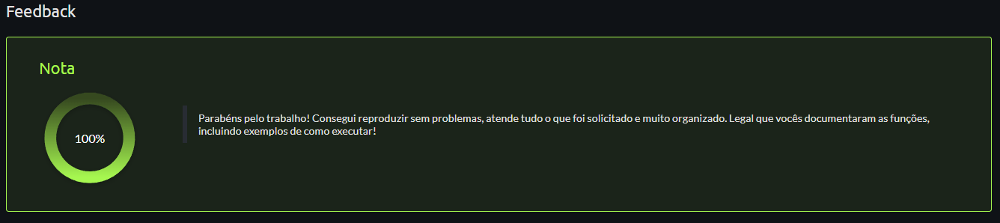

# Projeto Final | Sistema de Controle Financeiro

## Autores

- [@andreaseliass](https://github.com/andreaseliass)
- [@AnthonyHeimlich](https://github.com/AnthonyHeimlich)
- [@evertondcavalcante](https://github.com/evertondcavalcante)
- [@JuliaMidoriRW](https://github.com/JuliaMidoriRW)
- [@luana-kruger](https://github.com/luana-kruger)

### Instituição

- Ada Tech em parceria com a Santander
- Santander Coders 2023.2

## Documentação

### Descrição do Projeto
&nbsp;
Este código foi desenvolvido como parte do projeto final do Santander Coders 2023.2, e tem como objetivo criar um sistema para controle financeiro. O sistema permite receber as movimentações financeiras do usuário e armazená-las em um arquivo CSV ou JSON para fácil acesso e análise.

### Funcionalidades:
&nbsp;
O sistema conta com as seguintes funcionalidades:

* **Calcular Rendimento**: Função para calcular o rendimento com base nas movimentações.
* **Criar Registro**: Permite adicionar novas movimentações ao sistema.
* **Ler Registro**: Para ler uma movimentação específica com base no ID.
* **Atualizar Registro**:Atualiza os dados de uma movimentação existente.
* **Deletar Registro**:Remove uma movimentação do sistema com base no ID.
* **Atualizar Rendimento**:Função para atualizar o rendimento com base nas movimentações.
* **Exportar Relatório**:Permite exportar o relatório de movimentações para um arquivo CSV.
* **Agrupar**: Agrupa as movimentações por tipo.
* **Verificar Formato de Data**: Função para verificar e validar o formato da data das movimentações.

### Testes Executados
&nbsp;
Foram realizados testes para assegurar o funcionamento correto das seguintes operações:

* **Criar registro**
* **Ler registro**
* **Atualizar registro**
* **Deletar registro**
* **Atualizar rendimento**
* **Exportar relatório em formato CSV**
* **Agrupar movimentações por tipo**
* **Consultas por tipo**
* **Testes com interação com o usuário**

### Avaliação de Feedback:

O sistema foi avaliado com um feedback de 100%, indicando que atendeu completamente às expectativas e requisitos estabelecidos.

